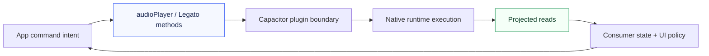

Legato playback is easiest to reason about as two concurrent paths:

- a **write path** where app intent is sent as commands (`setup`, `add`, `play`, `seekTo`, `stop`, `reset`), and
- a **read path** where the runtime projects observable state (`getSnapshot()`, playback events, `getCapabilities()`).

Understanding this split is what prevents consumer code from mixing intent with observation.

## Lifecycle as a system loop

The loop repeats continuously during playback sessions: commands move forward, projections come back, product policy reacts.

## Phase view

### 1) Setup phase

`setup()` establishes runtime readiness on the playback and/or media-session surfaces. Architecturally, this is the boundary handshake: consumer code can issue intent, but runtime authority still decides whether execution succeeds.

### 2) Queue insertion phase

`add({ tracks, startIndex })` mutates runtime queue state and returns a `PlaybackSnapshot`. This is the first explicit read-model projection after a write operation:

- write side: enqueue tracks,
- read side: receive updated queue/current index snapshot.

### 3) Playback start and transitions

`play()` expresses intent to start playback. Observable progression arrives through read channels such as:

- `playback-state-changed` with `PlaybackState` literals,
- `playback-progress` with timeline evidence (`position`, nullable `duration`, nullable `bufferedPosition`),
- `playback-active-track-changed` and `playback-queue-changed` when active item/queue projection changes.

The command itself is not the source of truth for resulting state; emitted projections are.

### 4) Ongoing runtime projection

During execution, the consumer can read through multiple lenses:

- **snapshot lens**: `getSnapshot()` for a full current projection,
- **event lens**: typed events for incremental updates,
- **capability lens**: `getCapabilities().supported` for current operation availability.

These lenses complement each other; they are not interchangeable.

### 5) Error and terminal phases

Runtime failures surface as `playback-error` with `LegatoError` (`code`, `message`, optional `details`). Normal terminal flow can surface as `playback-ended` carrying a terminal `snapshot`.

Both are read-path outcomes. They are not guarantees about retries, automatic recovery, or global ordering beyond what the public contract documents.

### 6) Stop, reset, and resync semantics

- `stop()` expresses stop intent and relies on subsequent read projection for resulting observable state.
- `reset()` performs queue/state reset and returns a new `PlaybackSnapshot` projection.
- `resync()` (via sync controller) re-anchors local consumer state on runtime `getSnapshot()` when local projection confidence is low (for example app resume).

## Why this matters for architecture decisions

If write and read concerns are merged in the same mental model, teams commonly produce stale UI assumptions and hidden race conditions.

Legato's public model encourages the opposite:

- commands represent requested mutations,
- projections represent observed reality,
- and product behavior should branch on projected reality (`snapshot`, events, capabilities, error codes), not on command optimism.

## Related pages

- [Consumer State Model](./consumer-state-model/)
- [Guarantees and Non-Guarantees](./guarantees-and-non-guarantees/)
- [Use Sync Controllers](/packages/capacitor/how-to/use-sync/)
- [Production Quickstart (Capacitor)](/how-to/production-quickstart-capacitor/)
