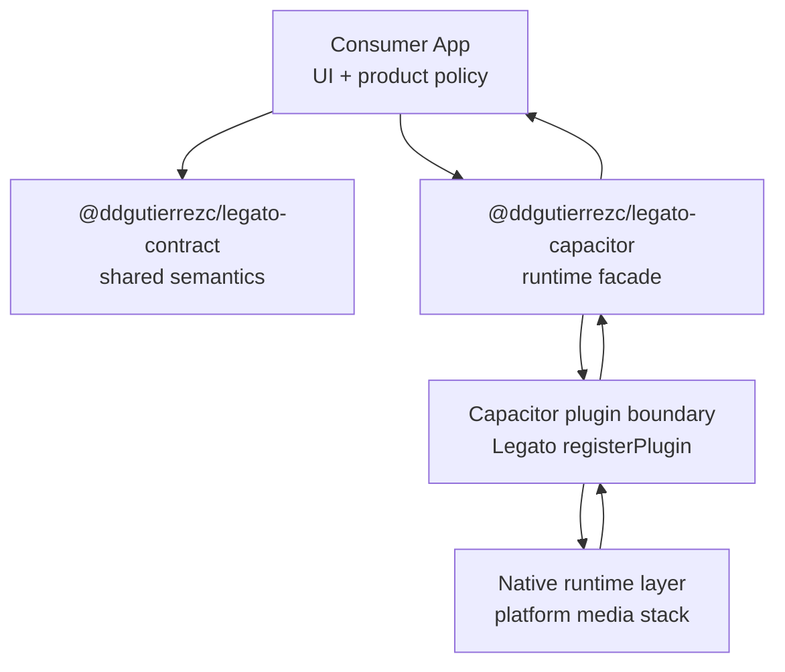

Legato is a layered playback system with explicit semantic and runtime boundaries.

At a high level, the consumer app reads and reacts to shared semantics, while runtime-specific code executes playback and projects runtime state back into those semantics.

## Layer model

## Responsibilities by layer

### Consumer app

The application owns product policy and user experience decisions:

- deciding how to render controls and state,
- deciding fallback behavior on errors,
- and deciding how often to read runtime capability projection.

The app SHOULD treat contract-level literals and payload shapes as compatibility anchors.

### `@ddgutierrezc/legato-contract`

The contract package defines shared semantics without transport/runtime execution:

- stable event-name vocabulary (`LEGATO_EVENT_NAMES`),
- stable payload maps (`LegatoEventPayloadMap`),
- stable error-code literals (`LEGATO_ERROR_CODES`),
- stable capability vocabulary (`CAPABILITIES`),
- and snapshot/state/queue type semantics (`PlaybackSnapshot`, `QueueSnapshot`, `PlaybackState`).

This is the semantic source of truth for cross-layer interpretation.

### `@ddgutierrezc/legato-capacitor`

The Capacitor package is the runtime integration facade:

- it re-exports contract types for typed consumption,
- exposes command/query surfaces (`audioPlayer`, `mediaSession`, `Legato`),
- and forwards typed listener registration to the plugin boundary.

It does not redefine contract meaning; it projects runtime behavior into the contract model.

### Runtime/native layer

The runtime/native layer executes playback and media-session behavior through the Capacitor plugin.

It owns dynamic outcomes such as:

- whether a capability is currently supported,
- when specific runtime events are emitted,
- and platform-specific execution details hidden behind the plugin API.

## Read/write direction

- Write direction: app issues commands through the Capacitor surface.
- Read direction: app consumes snapshots/events/error payloads shaped by contract semantics.

This split lets product code stay anchored to stable meaning while runtime execution remains replaceable.

## Related pages

- [Architecture](./)
- [Contract and Runtime Boundaries](./contract-and-runtime-boundaries/)
- [Guarantees and Non-Guarantees](./guarantees-and-non-guarantees/)
